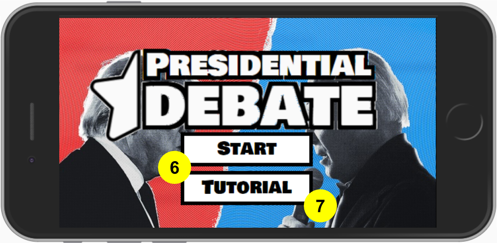
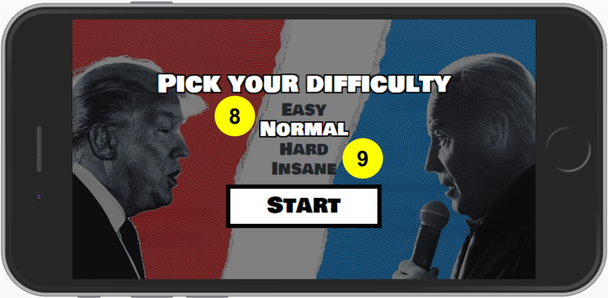
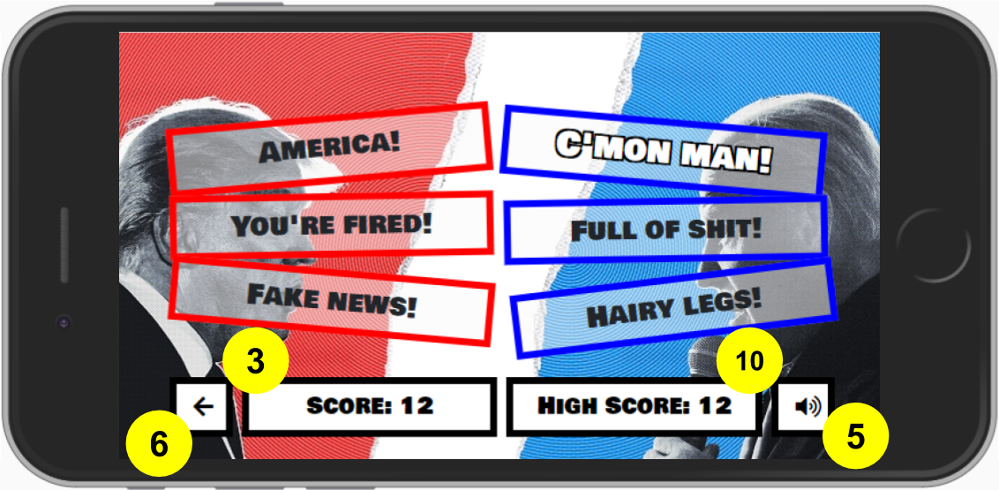
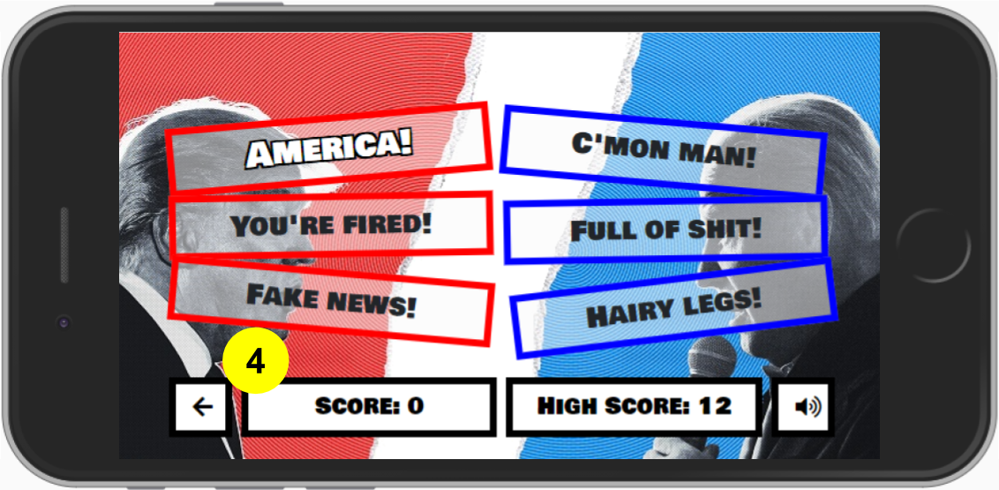
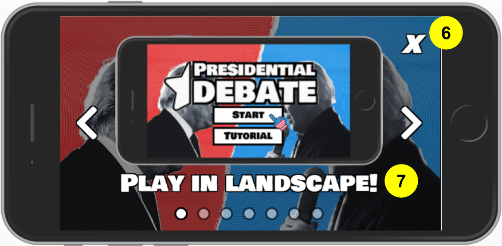

# Testing

## Table of Contents

- [Testing During Development](#testing-during-development)
- [Code Validation](#code-validation)
    - [HTML](#html)
    - [CSS](#css)
    - [JavaScript and JQuery](#javascript-and-jquery)
    - [Responsiveness](#responsiveness)
    - [Accessibility](#accessibility)
    - [Performance](#performance)
- [Testing User Stories](#testing-user-stories)

Click [here](README.md) to return to the main document.

## Testing During Development
My main method of testing my JavaScript code throughout the development process was using `console.log` within each function to report on what variables were being generated at each stage of the game. I then used the Console on the Google Developers tool to read the output and subsequently make changes to my code to fix any unpredictable behaviour. This helped to fix the following bugs:
- **93c71fd** _Bug fix: Remove level 1 win error -_ On the first level the user's turn would be successful regardless of the turn input. Initially the `newGame()` function set `game.count = 1` but I realised through testing that it needed to be set to 0.
- **a705a14** _Bug fix: difficulty input now works consistently -_ When I first implemented the difficulty menu, I found that `difficulty: 1` in the game variables regardless of the user input at the start of the game. After researching the issue online, I tried wrapping the _unordered list_ in a _form_ which solved the problem.
- **175c69b** _Bug fix: randSequence() no longer generates sequential equal values in compSequenceArr[] -_ If `game.next = (Math.floor(Math.random() * 6))` in `randSequence()` generated 2 identical values next to each other in `compSequenceArr[]`, the audio files would overlap creating an unpleasant experience for the user. This was especially evident in the harder difficulties. I added
 ```
 while (game.next === game.prev) { // Sequential numbers can't be the same
 game.next = (Math.floor(Math.random() * 6));
 }
 ```
 to prevent sequential array values being the same, and also added the `text-pop` class into the box reactions to give the user some visual feedback from the game too.

## Code Validation
### HTML
I used the W3C Markup Validation Service to test the validity of my HTML. It flagged the use of alt tags on the carousel component on tutorial.html. I replaced these with the same description hidden within a span element with a sr-only class.
### CSS
I used the W3C CSS Validation Service to test the validity of my CSS. It didn't flag any issues.
### JavaScript and JQuery
I used JSHint to test the validity of my JavaScript and JQuery. It highlighted that I was missing semicolons at the end of my game variables definition and my onload function on game.js.
### Responsiveness
I used Google Developer tools to test the layout of my site on multiple device sizes, and also shared the deployed site with my family and friends for them to test on their devices too. I used their feedback to finetune the CSS and position all elements correctly.
### Accessibility
I used WAVE (The Web Accessibility Evaluation Tool) to test the accessibility of my site which highlighted the following errors:
- A missing _fieldset_ element that should wrap the _unordered list_ on game.html. I added this along with a _legend_ element which resolved the issue.
- Some of the images used on tutorial.html were missing _alt_ tags.
- It also flagged a lack of semantic elements on each page. As there is very little text, I felt justified in mainly using _divs_ throughout the site and didn't make any changes.
### Performance
I used the Lighthouse tool on the Google Developer software to test the performance of my game. It flagged that the images throughout the site were quite large, so I reloaded them after compressing the files which improved my overall score to 93/100.

## Testing User Stories
_**Site owner**_
1. _As the site owner, I want the site users to enjoy playing the game so that the game becomes popular._
    - As "enjoying" a game is quite subjective to whoever is playing it, I shared _Presidential Debate_ with 20 of my friends and family and asked them to score it out of 10 for "enjoyable experience", "aesthetic design" and "functionality" to try and gather some quantitative feedback. For "enjoyable experience", it scored an average of 8.8 which is a good indication that the game meets this criteria.
2. _As the site owner, I want the website to be aesthetically pleasing to demonstrate my ability to code in HTML and CSS and to create a positive UX experience for the site users._
    - The consistent graphics, colour scheme and CSS animations throughout the site create a positive UX experience for the player. My personal opinion was reinforced by an average score of 9.3 for "aesthetic design".
3. _As the site owner, I want the game to function well to demonstrate my ability to code in JavaScript and JQuery and to create a positive UX experience for the site users._
    - The JavaScript and JQuery code is efficient and bug free, and the different functions interact with each other without issue, indicating that the game functions well. My friends and family agreed with an average score of 8.9 for "functionality".

_**Site users**_
1. _As a site user, I want to enjoy playing the game._
    - See 1 in Testing User Stories - Site owner.
2. _As a site user, I want the game to load quickly and not lag so I am not distracted from playing the game._
    - The website has a Lighthouse performance score of 93/100 indicating that the game loads quickly and won't lag.
3. _As a site user, I want to receive feedback when I play the game correctly so I know what I've done right._
    - A successful turn is evident by the score increasing and the game continuing.
4. _As a site user, I want to receive feedback when I play the game incorrectly so I know that I've made a mistake._
    - An unsuccessful turn is evident by the wrestling bell sounding, the boxes shaking, the correct input playing three times and the difficulty menu reappearing.
5. _As a site user, I want to be able to turn the sound on and off depending on my surroundings._
    - The user can turn the sound on and off using the speaker icon in the bottom right corner of the screen.
6. _As a new site user, I want the website to be easy to navigate so I can find the game and the instructions quickly._
    - The site layout is simple, and the user can immediately start a game or read the instructions from the 'Home' page. The user can also navigate back to the 'Home' page with a single click on both the 'Game' and 'Tutorial' pages.
7. _As a new site user, I want clear instructions on how the game works so I can start playing quickly._
    - The instructions are made up of short, clear sentences and animations of the game being played to illustrate what will happen during the game.
8. _As a new site user, I want to be able to select an easy difficulty so I can get the hang of the game._
    - The user can pick one of the easier difficulties which will score fewer points but increase the time between soundbites.
9. _As a returning site user, I want to be able to select a harder difficulty so I can challenge myself and score more points._
    - The user can pick one of the harder difficulties which will score more points but decrease the time between soundbites.
10. _As a returning site user, I want to be able to see my high score so I can try to beat it._
    - The user can see their high score in the bottom right corner of the screen. When they are beating their previous high score, the high score box starts to shake to give positive feedback to the player.

The following screenshots of the game show the numbered user stories in action:





